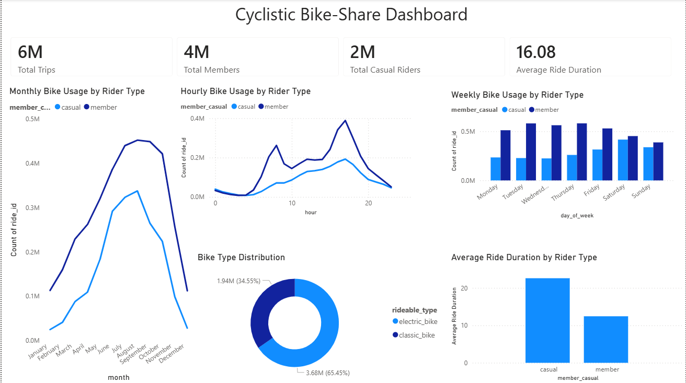

## 📌 Google Data Analytics Capstone Project

# 🚴 Cyclistic Bike-Share Analysis

## 📌 Project Overview

This project analyzes one year of Cyclistic bike-share trip data to understand how annual members and casual riders use the service differently.

The objective is to identify behavioral patterns, uncover meaningful insights, and provide data-driven recommendations that can help Cyclistic convert more casual riders into annual members.

Python was used for data cleaning and feature engineering, while Power BI was used to build an interactive dashboard that communicates the findings effectively.

---

## 🎯 Business Problem

Cyclistic's primary business challenge is converting casual riders into annual members.

Annual members generate more predictable long-term revenue, making membership growth an important business objective.

To support this goal, this project seeks to answer the following business question:

> **How do casual riders and annual members use Cyclistic bikes differently?**

By identifying behavioral differences between the two groups, this analysis provides insights that can support targeted marketing strategies and encourage more casual riders to become annual members.

---

## 📊 Dataset

- **Dataset:** Cyclistic Bike-Share Historical Trip Data
- **Duration:** 12 Months
- **Records:** Approximately 6 Million Trips
- **Source:** Google Data Analytics Capstone Case Study (Divvy Bike Share Data)

The dataset contains trip-level information including:

- Ride ID
- Rider Type
- Rideable Type
- Start & End Time
- Ride Duration
- Start & End Stations
- Geographic Coordinates

---

## 🛠️ Tools & Technologies

- Python
- Pandas
- NumPy
- Jupyter Notebook
- Power BI
- DAX
- Git & GitHub

---

## 🔄 Project Workflow

```
Business Problem
        ↓
Data Collection
        ↓
Data Cleaning & Feature Engineering (Python)
        ↓
Exploratory Data Analysis
        ↓
Power BI Dashboard
        ↓
Business Insights
        ↓
Recommendations
```

---

## 🧹 Data Cleaning & Preparation

The dataset was cleaned and transformed using Python.

### Data Cleaning

- Removed duplicate records
- Removed missing values
- Converted datetime columns
- Removed invalid ride durations
- Standardized data types

### Feature Engineering

Created new analytical columns including:

- Ride Length (Minutes)
- Month
- Month Number
- Day of Week
- Day Number
- Hour of Day

These features enabled trend analysis across time and rider segments.

---

## 📈 Exploratory Data Analysis

The analysis focused on answering key business questions such as:

- How many rides were taken by each rider type?
- Which months experience the highest bike usage?
- What hours are most popular for riding?
- How does weekday usage differ between rider types?
- Which rider group has longer average ride durations?
- Which bike type is preferred by riders?

---

## 📊 Dashboard

The Power BI dashboard provides an interactive overview of rider behavior.

### Dashboard Highlights

- Total Trips
- Total Annual Members
- Total Casual Riders
- Average Ride Duration
- Monthly Bike Usage
- Hourly Bike Usage
- Weekly Bike Usage
- Bike Type Distribution
- Average Ride Duration by Rider Type

> **Dashboard Preview**



---

## 💡 Key Insights

### Annual Members

- Account for approximately **4 million** rides.
- Ride significantly more frequently than casual riders.
- Peak usage occurs during weekday commuting hours.
- Have shorter average ride durations.

### Casual Riders

- Account for approximately **2 million** rides.
- Ride longer on average than annual members.
- Show stronger recreational riding behavior.
- Usage increases during warmer months and weekends.

### Overall

- Electric bikes are the most frequently used bike type.
- Clear behavioral differences exist between commuting and leisure riders.

---

## 📌 Business Recommendations

Based on the analysis, Cyclistic should consider:

- Offering weekend membership promotions targeting casual riders.
- Providing discounts after a certain number of casual rides.
- Launching seasonal membership campaigns during peak riding months.
- Marketing annual memberships near tourist and recreational areas.
- Introducing loyalty rewards that encourage casual riders to upgrade.

---

## 📁 Repository Structure

```
Cyclistic-Bike-Share-Analysis/
│
├── data/
│   └── cyclistic_cleaned.csv
│
├── notebooks/
│   └── Cyclistic_Analysis.ipynb
│
├── images/
│   └── dashboard.png
│
├── README.md
├── requirements.txt
└── .gitignore
```

---

## 🚀 Future Improvements

Future enhancements for this project may include:

- Interactive filters and slicers in the dashboard.
- Geographic visualization of popular stations.
- Weather-based ride pattern analysis.
- Predictive modeling for membership conversion.
- Time-series forecasting of bike demand.

---

## 👨‍💻 Author

**Anay Soundankar**

Aspiring Data Analyst passionate about transforming data into actionable business insights.

### Skills

- Python
- SQL
- Power BI
- Excel
- Pandas
- NumPy
- Data Visualization
- Exploratory Data Analysis

---

## ⭐ Project Summary

This project demonstrates an end-to-end data analytics workflow—from understanding a business problem and cleaning raw data to building an interactive dashboard and generating actionable business recommendations.

The analysis showcases practical skills in Python, data preparation, Power BI visualization, and business storytelling, reflecting the complete lifecycle of a real-world data analytics project.
